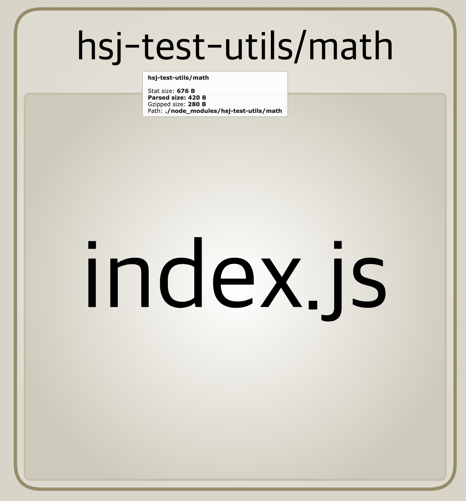
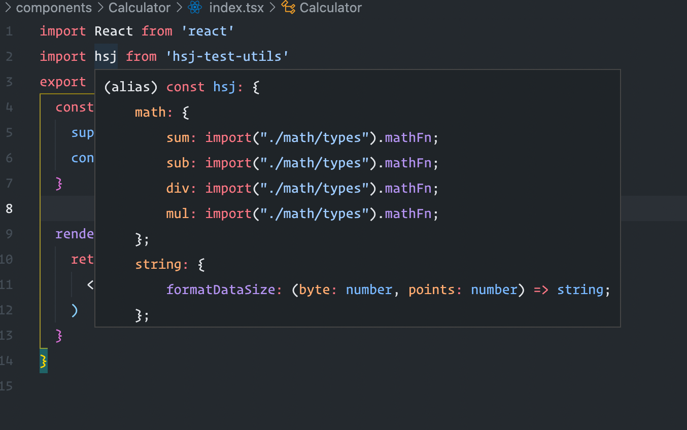
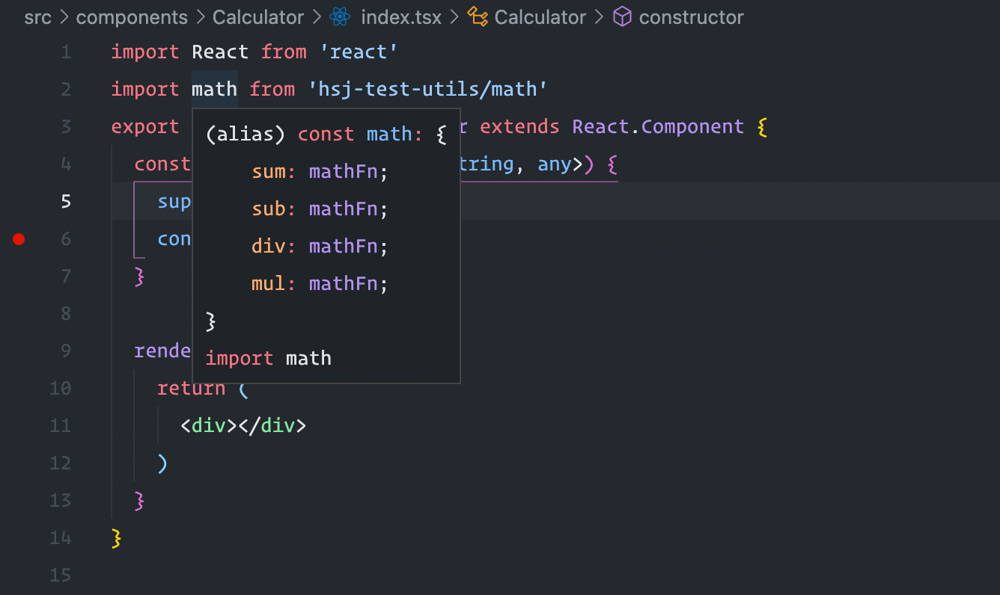

# Dive-To-Jest

## Steps

#### Installation

```bash
$ npm install jest tsc -D
```

```bash
$ tsc --init
```

```bash
$ eslint --init
```

```bash
$ npm install webpack webpack-cli webpack-dev-server webpack-merge webpack-bundle-analyzer -D
```

```bash
$ npm install @babel/core @babel/preset-env @babel/preset-typescript @babel/cli core-js babel-loader -D
```

```bash
$ npm install typescript -D
```

#### Goal

> Jest 공부하려다가 여기까지 와버렸다;;

- `src` 구조는 아래처럼 유지할 수 있어야 한다.

```bash
➜  src git:(master) ✗ tree 
.
├── index.ts
├── math
│   ├── index.test.ts
│   ├── index.ts
│   └── types.ts
└── string
    ├── index.test.ts
    ├── index.ts
    └── types.ts
```
```bash
dist git:(master) ✗ tree
.
├── index.d.ts
├── index.d.ts.map
├── index.html
├── index.js
├── index.js.map
├── math
│   ├── index.d.ts
│   ├── index.d.ts.map
│   ├── index.js
│   ├── index.js.map
│   ├── index.test.d.ts
│   ├── index.test.d.ts.map
│   ├── types.d.ts
│   └── types.d.ts.map
├── package.json
└── string
    ├── index.d.ts
    ├── index.d.ts.map
    ├── index.js
    ├── index.js.map
    ├── index.test.d.ts
    ├── index.test.d.ts.map
    ├── types.d.ts
    └── types.d.ts.map
```

- `src/index.ts` 는 모든 모듈을 노출하며 개별 디렉토리에 접근하여 단독으로 사용할 수도 있다. (ex. `math`, `string`)

- 타 프로젝트에서 사용시 단독으로 사용하는 상황경우에는 빌드 단계에서 `Tree-Shaking` 이 동작해야 한다.

|`index.js`|`math/index.js`|
|:-----:|:-----:|
|||

- `*.d.ts` 파일을 통한 타입 힌팅이 적절히 동작해야 한다.

|`index.js`|`math/index.js`|
|:-----:|:-----:|
|||

- `build`, `deploy` 단계에서 잘 짜여진 `jest` 테스트 스크립트 통과후 배포할 수 있도록 한다. (이게 메인 목표였음.)

#### History

`[2021-09-22]`

- 빌드 및 배포 환경은 준비됨.

- 본격적으로 작성한 순수함수에 대해서 테스트 스크립트를 작성해보도록 하자.

- `22:17` webpack에서 `ESM` 형태로 내보내는 기능을 지원하고 있었다! 모듈별로 index.js 파일을 위치시키느라 설정에서 고생좀 했다.